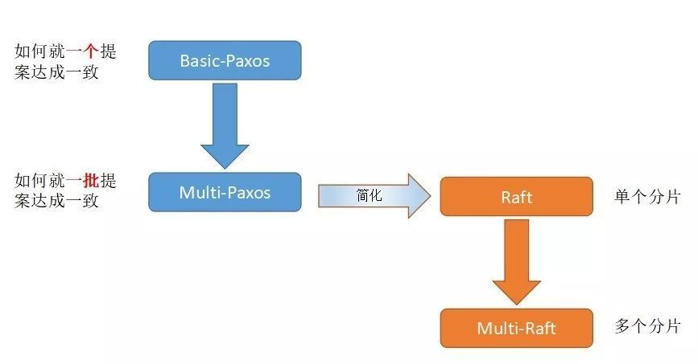

# MIT-6.824-LearningNotes
Paper and notes about Distributed System.

---

## Raft算法

> 大部分笔记都记录在Raft论文里了。以下只是raft的部分补充笔记。

### Raft的4个主要内容（leader选举、日志复制、安全性、日志压缩）：

- **Leader Election领带人选举**：Leader宕机后选取新的Leader

- **Log Replication日志复制**

- **Safety安全性**：

  - 日志只能从领导人流向Follower
  - 只有**当前Leader任期**的日志条目才能通过计算数目来进行提交。为了提交之前任期日志条目，只能通过在当前任期新commit了一个当前任期的日志条目，才能把在此之前的日志条目一并提交

- **成员变更**：join consensus共同一致

- **日志压缩**：snapshot快照。

  - **何时发送InstallSnapshotRPC？**

    =>当Leader发送AppendEntryRPC是，发现目标Follower的nextIndex比自己第一个log的index还小时，就把自己的Snapshot发送给该Follower

### 如何解决脑裂？

- 

---

## Multi-Raft算法

- 多个Raft集群，每个集群一个数据库分片，以达到负载均衡。多个Raft集群可以协同以减少资源开销
- Multi-Raft --> **TiDB、CockroachDB、PolarDB**
- Parallel-Raft是PolarDB中的Multi-Raft实现，通过支持乱序日志复制（乱序确认、乱序提交、乱序应用）等手段来提升性能。

---

## Basic-Paxos算法

---

## Multi-Paxos算法